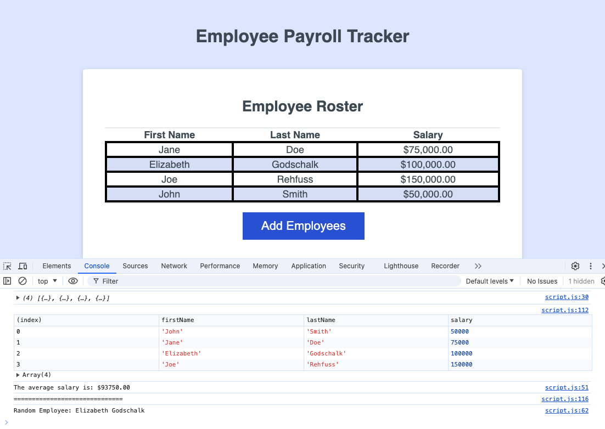

# Employee-Payroll-Tracker

This application allows employees names and salaries to be added to a table. It calculates the average salary of the employees entered, and also selects a random employee.

## Deployed Site
https://egodschalk.github.io/Employee-Payroll-Tracker

## GitHub Repo
https://github.com/egodschalk/Employee-Payroll-Tracker

## Screenshot
